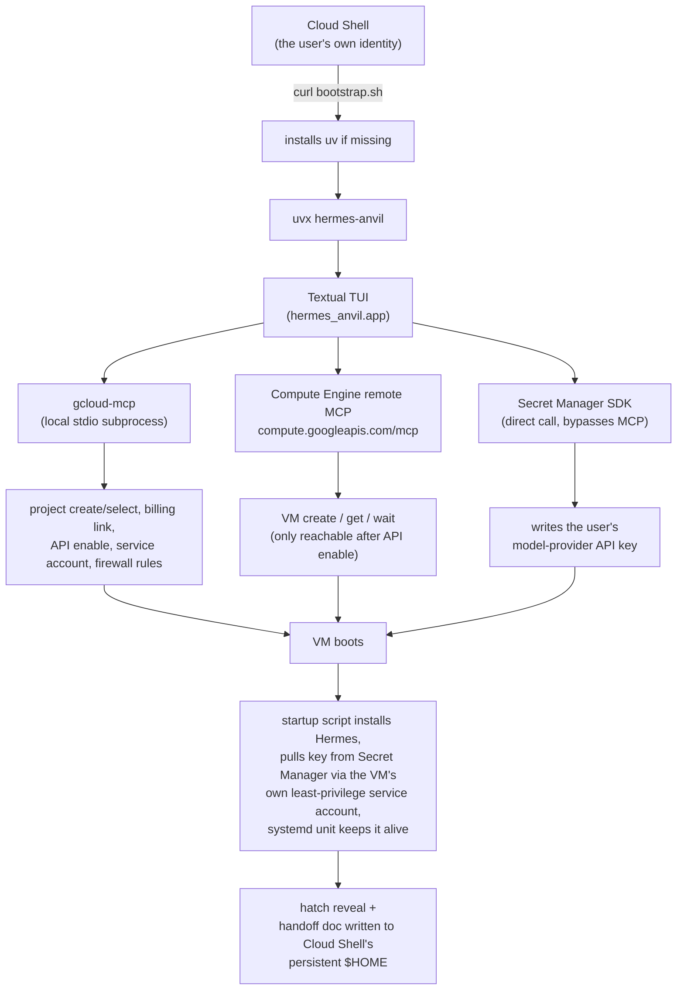
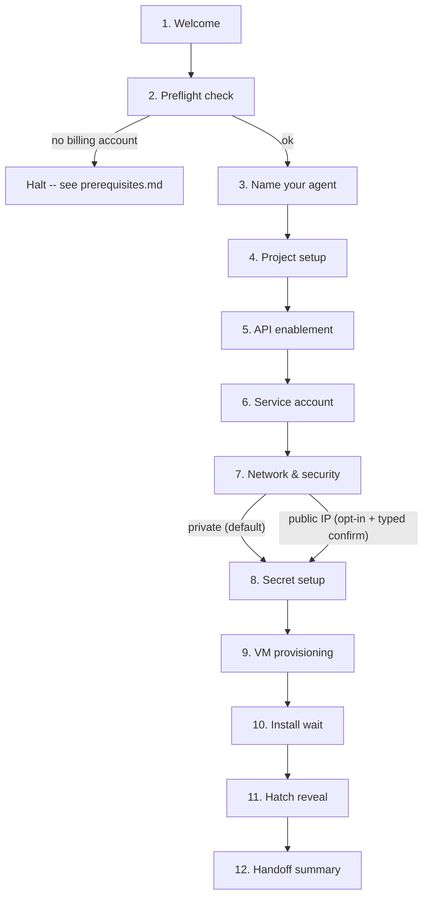

# Architecture

## Why it's built this way

The target audience is non-developers: people comfortable copy-pasting a command, not debugging `gcloud` errors. The design decisions below all trace back to that constraint, plus one deliberate choice: users own their agent afterward, so it lives in *their* GCP project under *their* billing, not a shared operator-owned one.

## Scope boundary

GCP account creation and billing/free-trial signup are interactive, human, browser-based steps that Google requires and that cannot be scripted. The harness's job starts **after** that's done, see [prerequisites.md](prerequisites.md). From there, the harness owns everything: project creation, API enablement, VM provisioning, and installing/configuring Hermes.

## End-to-end flow



## Why two MCP servers, routed through one client

Google offers two relevant MCP servers, and neither covers the whole job on its own:

- **[gcloud-mcp](https://github.com/googleapis/gcloud-mcp)** (`@google-cloud/gcloud-mcp`, local stdio subprocess via `npx`) wraps the gcloud CLI generally, using whatever identity is already active in Cloud Shell. It's the only one of the two that can create a project, link billing, enable APIs, or set up IAM/firewall rules.
- **[Compute Engine remote MCP server](https://docs.cloud.google.com/compute/docs/use-compute-engine-mcp)** (`https://compute.googleapis.com/mcp`) is official and purpose-built for VM lifecycle (create/get/wait, templates, disks), but it only becomes reachable *after* the Compute Engine API is enabled on the project, a real chicken-and-egg gap that gcloud-mcp's project/API-enable step resolves first.

Both are fronted by one router (`mcp/tool_router.py` in the eventual codebase) so "route everything through MCP" holds at the architecture level even though two servers sit underneath. The one deliberate exception: writing the user's model-provider API key goes straight to the Secret Manager Python SDK, in-process, never through a subprocess CLI or shell command, see [security.md](security.md) for why.

## Tech stack

**Python 3.11+ with [Textual](https://textual.textualize.io/)** for the TUI.

- Cloud Shell ships Python 3.11+ preinstalled, no interpreter bootstrap needed.
- The official `mcp` Python SDK speaks both stdio (gcloud-mcp) and streamable-HTTP (Compute Engine MCP) through one client abstraction.
- Textual gives a real full-screen guided wizard instead of scrolled `gcloud` output, native async that pairs with long-running polls (API propagation, VM boot), and theming for the "hatch" reveal moment.
- Fallback if Textual proves heavy under time pressure: `rich` + `prompt_toolkit` linear flow.

## Repo layout

```
hermes-anvil/
  pyproject.toml
  README.md
  docs/
    prerequisites.md
    architecture.md
    security.md
  src/hermes_anvil/
    __main__.py            # `python -m hermes_anvil` / `hermes-anvil` console_script
    cli.py                  # --dry-run, --resume, --allow-public-ip, --teardown, --project
    app.py                   # Textual App, screen-stack orchestrator, global state
    theme.py                  # hatch palette, ASCII art, animation helpers
    screens/
      welcome.py, prereq_check.py, name_your_agent.py, project_setup.py,
      api_enable.py, service_account.py, network_security.py, secret_setup.py,
      vm_provision.py, hermes_install_wait.py, hatch_reveal.py, handoff_summary.py
    mcp/
      client.py              # wrapper over `mcp` SDK, stdio + http transports
      gcloud_server.py        # spawns/manages `npx @google-cloud/gcloud-mcp`
      compute_server.py        # client for compute.googleapis.com/mcp, hourly token refresh
      tool_router.py            # single source of truth for which server handles what
    gcp/
      naming.py, state.py (resumable ~/.hermes-anvil/<slug>.json),
      preflight.py, bootstrap.py, identity.py, network.py, secrets.py, compute.py,
      startup_script.sh.j2
    dryrun/fakes.py           # fake MCP responses for $0 local runs
    theming/ascii_art.py
  scripts/
    bootstrap.sh               # hosted curl-pasted entrypoint
    dev_teardown.sh
  tests/
    test_naming.py, test_state_resume.py, test_dryrun_flow.py, test_tool_router.py
```

## User flow (screens map 1:1 to `screens/`)



1. **Welcome** — theme intro, "press Enter to begin hatching."
2. **Preflight** — checks `gcloud auth list`, Cloud Shell signal (`DEVSHELL_PROJECT_ID`), and `gcloud billing accounts list` (via gcloud-mcp). No billing account halts with a message pointing at the prerequisites doc. This is the harness enforcing the scope boundary above.
3. **Name your agent** — free text, slugified into a shared resource-naming `slug` used for every resource below.
4. **Project setup** (gcloud-mcp) — check `~/.hermes-anvil/<slug>.json` for a prior run, verify referenced resources still exist before offering resume; otherwise create `hermes-anvil-<slug>-<suffix>`, link billing, verify the link.
5. **API enablement** (gcloud-mcp) — enable `compute`, `iap`, `secretmanager`, `iam`; poll until active. This is the exact point the Compute Engine MCP server becomes usable.
6. **Service account** (gcloud-mcp) — dedicated `hermes-vm-<slug>@...`, bound only to `roles/secretmanager.secretAccessor` (scoped to one secret) + `roles/logging.logWriter`. Never the default/broad Compute Engine SA.
7. **Network & security** (gcloud-mcp) — default: no external IP, `allow-iap-ssh-<slug>` firewall rule scoped to Google's fixed IAP range `35.235.240.0/20` only. Opt-in public IP requires an explicit confirmation phrase; firewall scoped to the user's detected `/32`, restated again on the final handoff screen.
8. **Secret setup** (direct SDK call) — masked input, written straight to Secret Manager as `hermes-agent-key-<slug>`, never echoed, never touches a shell command line or disk.
9. **VM provisioning** (Compute Engine MCP server) — renders `startup_script.sh.j2` (installs Hermes, pulls the key from Secret Manager at boot via the VM's own service account, systemd unit). Creates `hermes-vm-<slug>`: `e2-small`, 20GB pd-balanced, no external IP, shielded-VM on.
10. **Install wait** — poll RUNNING via Compute MCP, then poll for a startup-script-completion sentinel.
11. **Hatch reveal** — the payoff screen.
12. **Handoff summary** — writes `~/hermes-anvil-<slug>-handoff.md` to Cloud Shell's persistent home directory: reconnect command (`gcloud compute ssh hermes-vm-<slug> --zone=... --tunnel-through-iap --project=<project>`), how to check logs/status, how to rotate the API key, `hermes-anvil --teardown`, a note that self-management MCP wiring is available later (deferred, see below), and a ready-to-uncomment `mcp_servers:` snippet for Google's Workspace MCP server (Gmail/Calendar/Drive/Chat).

**Resumability**: state is written after each completed step; on re-run, every referenced resource is re-verified via `describe` calls before skipping ahead, so a manually-deleted resource or partial failure self-heals into resume-from-first-broken-step rather than assuming success.

## Distribution

```
curl -fsSL https://raw.githubusercontent.com/frieddeli/Hermes-Anvil/main/scripts/bootstrap.sh | bash
```

Hosted directly off this repo's `main` branch via GitHub's raw-content URL, no custom domain or separate hosting needed, same pattern most CLI installers use.

`bootstrap.sh` installs [`uv`](https://astral.sh/uv) if missing (mirroring Hermes Agent's own installer philosophy), then runs `uvx hermes-anvil` (once published to PyPI) or `uvx --from git+https://github.com/frieddeli/Hermes-Anvil hermes-anvil` (pre-PyPI). PyPI-vs-git+https gets decided based on remaining churn as the project approaches its first real users.

## Deferred to v2

- **Hermes managing its own VM via MCP** (pointing the deployed agent's own `~/.hermes/config.yaml` at the Compute Engine MCP server so it can inspect/resize/manage its own infrastructure). Day-one infra control for a non-dev-operated agent is a bigger trust decision than the provisioning goal requires, noted in the handoff doc as something users can wire up themselves later, not shipped as a default.

Extending an agent with **Google Workspace services (Gmail/Calendar/Drive/Chat)** is different and *not* deferred: it's normal personal-productivity access, not infra control, so the handoff doc ships ready-to-uncomment config pointing at Google's official [Workspace MCP server](https://docs.cloud.google.com/mcp/supported-products) rather than raw API calls.

## Testing without burning real GCP spend

- `--dry-run` (default for CI/fast iteration): every GCP-touching call goes through `dryrun/fakes.py` instead of real MCP/SDK calls, with configurable injected failures to exercise the resume logic, at $0.
- A personal/dev GCP project, separate from any real user's project, for real end-to-end runs.
- `scripts/dev_teardown.sh` deletes the VM/firewall/SA/secret/(optionally) project after each dev iteration.
- A small (~$5) budget alert on the dev project catches anything a failed teardown leaves behind.
- One full real run before shipping calibrates realistic install/boot timing for the TUI's polling timeouts.
